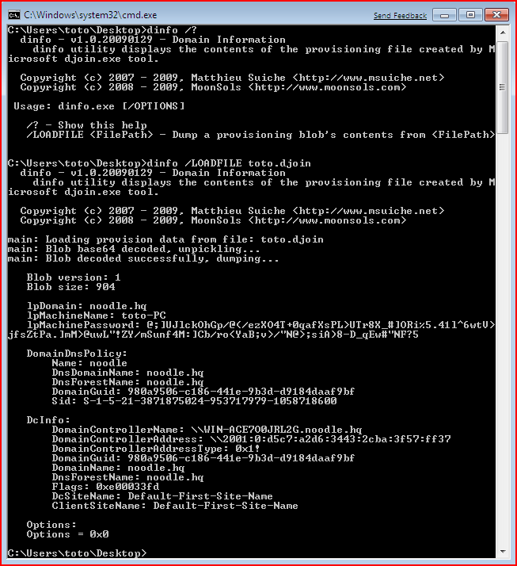

# Offline Domain Join Metadata File Decoder
Offline domain join is a  process that joins computers running Windows® 7/Windows Server 2008 R2 and later to a domain in Active Directory Domain Services (AD DS)—without any network connectivity. This process includes a new command-line tool, Djoin.exe, which you can use to complete an offline domain join.

Run Djoin.exe to provision the computer account metadata. When you run the provisioning command, the computer account metadata is created in a .txt file that you specify as part of the command. After you run the provisioning command, you can either run Djoin.exe again to request the computer account metadata and insert it into the Windows directory of the destination computer.

More information on Offline Domain Join can be found at: https://technet.microsoft.com/en-us/library/offline-domain-join-djoin-step-by-step(v=ws.10).aspx

## Background
This is a utility I wrote in 2009, and recently @bradleykite asked for the source code. cf. https://twitter.com/bradleykite/status/816568795762397185

## djoin.exe metadata format
Run Djoin.exe to provision the computer account metadata. When you run the provisioning command, the computer account metadata is created in a .txt file that you specify as part of the command. After you run the provisioning command, you can either run Djoin.exe again to request the computer account metadata and insert it into the Windows directory of the destination computer.

These computer account metadata files are composed of a base64 string. This decoded base64 string is a DATA_BLOB encrypted by NetpEncodeProvisioningBlob / NetpDecodeProvisioningBlob private APIs from netjoin.dll which is new toWindows 7/Windows Server 2008 R2. Both functions calls NdrMesTypeDecode2 / NdrMesTypeEncode2 from RPCRT4.dll to perferm the encryption/decryption process.

Decoded blob file contains a structure I called “PROVISION_DATA” which is composed of information about Domain Dns Policy, Domain Controller, miscelleneous information about the machine and so on.

## Screenshots

